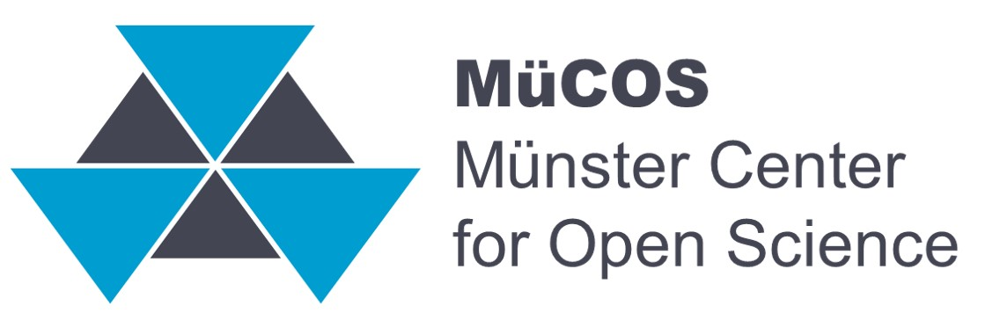

Open Science bezeichnet die Bemühungen von Wissenschaftlerinnen und Wissenschaftlern, Forschung nachvollziehbarer und dadurch robuster zu gestalten. Spezifische Techniken werden in verschiedenen Disziplinen entwickelt und sind jeweils auf spezifische Problemstellungen zugeschnitten. Auf dieser Website finden Sie die **Informationen zur Umsetzung von Open Science in verschiedenen Forschungsbereichen**.

{.lightbox fig-alt="In der Mitte steht Open Science. Drum herum ist ein eckiger zyklischer Prozess mit vier Punkten: 1. Offene Dokumentation der Ableitung neuer Forschungsfragen und Hypothesen des Forschungsplans, 2. offene Dokumentation dre verwendeten Materialien und erhobenen Dtaen. 3. Offene Veröffentlichung der Forschugnsergebnisse. Und 4. offene Kommunikation der Forschungsergebnisse."}

::: callout-tip
## Navigation auf dieser Seite

Wählen Sie den in der Kopfleiste zwischen **Fächerübergreifenden Informationen** und spezifischen Bereichen. Gehen Sie anschließend an den gewünschten Punkt des *Forschungszyklus* in der linken Seitennavigation.

-   Falls Sie sich unsicher sind, verschaffen Sie sich einen Überblick über [fächerübergreifende Informationen](https://lukasroeseler.github.io/MueCOS-Infomodule/fächerübergreifend.html).

-   Falls Sie spezifische Informationen suchen (z.B. zu "Green Open Access"), klicken Sie oben rechts auf die Lupe und geben den Suchbegriff ein.
:::

::: {.column-margin}

::: {.sidebar-widget}

  <i class="bi bi-envelope"></i> Kontakt
  <i class="bi bi-chevron-up"></i>

  <strong>Münster Center for Open Science</strong> 
  Fliednerstraße 21 
  Raum FL/P/2b 
  48149 Münster 
   
  <a href="mailto:email@uni-muenster.de"><i class="bi bi-envelope-fill"></i> lukas.roeseler@uni-muenster.de</a>

:::

::: {.sidebar-widget}

  <i class="bi bi-link-45deg"></i> Wichtige Links
  <i class="bi bi-chevron-up"></i>

  <a href="#"><i class="bi bi-chevron-right"></i> Themen und Ansprechpersonen</a>
  <a href="#"><i class="bi bi-chevron-right"></i> Flyer & Cheatsheets</a>

:::

:::

------------------------------------------------------------------------

[{fig-alt="MüCOS Logo: Sechs graue und blaue Dreiecke, daneben steht MüCOS Münster Center for Open Science" width="450"}](https://www.uni-muenster.de/MueCOS/index.html)
